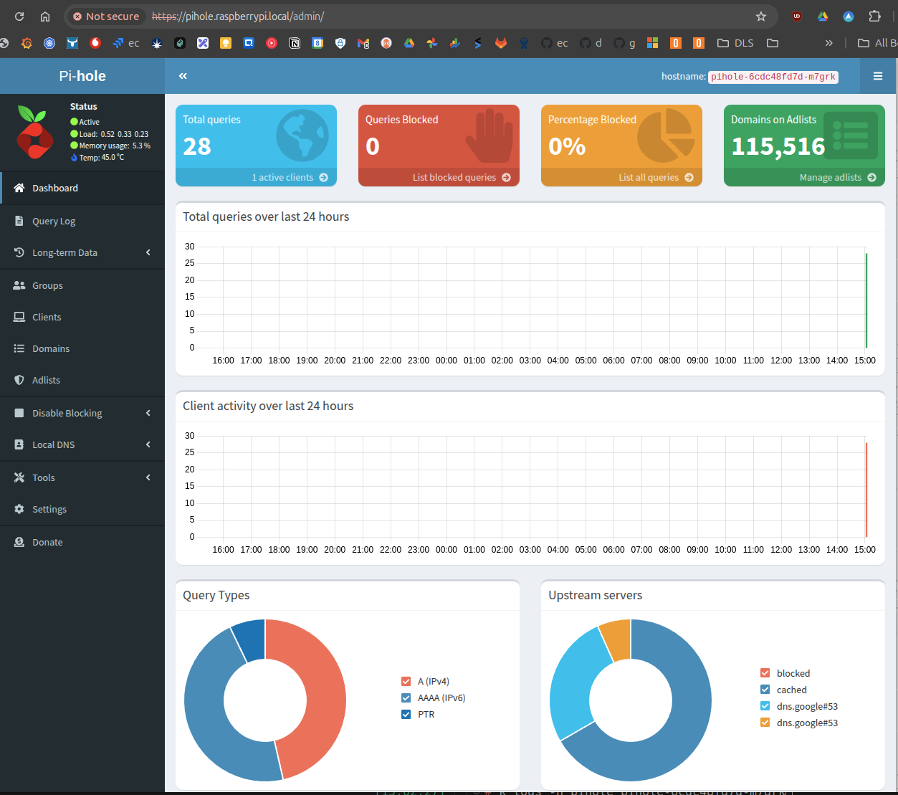

# Notes for Gary's single raspeberry pi setup

This branch has been tuned to install what Gary needs to get pihole working on his Raspberry Pi with k3s.

Note requires a Pi with an OS already installed and contactable via ssh.
Also note that it will delete any current k3s installation, including all deployed services and data.

## Assumptions

I have assumed that your pi is addressable locally with the hostname `raspberrypi.local`. If this is not the case, you will need to change:

hosts.yml
```yaml
extra_nodes:
  hosts:
    raspberrypi.local:
```
and group_vars/all.yml
```yaml
local_domain: .local # how to address local nodes with dig
control_plane: raspberrypi # the node name of the control plane
cluster_domain: raspberrypi.local # the DNS name for the cluster control plane node
```

## Installation

### On the host
Follow these instructions to create a keypair for ansible account and get the public key into the project.
[keypair instructions](setup.md)

Add the following to your /etc/hosts file, all pointing at the IP address of your pi.
- dashboard.raspberrypi.local
- grafana.raspberrypi.local
- pihole.raspberrypi.local
- echo.raspberrypi.local

The reason for this is so that we have a nice name for the root ingress into each of the apps we are installing. I prefer this to using raspberrypi.local/dashboard etc. Because the ingress is tidier and compatible with letsencrypt wildcard certs which I am using for my own setup.

### In the dev container

Fire up this project in branch `gary` and open the developer container.

Now add the ansible account with trust of the key just made (and no password) to all of your non-turing pi hosts (i.e. in this case just the one standalone pi).

```bash
ANSIBLE_HOST_KEY_CHECKING=False ansible-playbook pb_add_nodes.yml
```

Now you can install k3s and pihole with:

```bash
ansible-playbook pb_ALL.yml -e k3s_force=true
```
You want the k3s_force=true this first time you run the playbook as it will remove any existing k3s installation if there is one. The great thing about this is that you can run this playbook again and again and it will only install the missing parts (e.g. you might choose to uncomment grafana from cluster_install_list and re-run the playbook to install it).

## Try it out

If all went well you should be able to access the following URLS. You will be warned that they are all unsafe because you are using self signed certificates for the SSL. I've got let's encrypt wildcard certs working on my setup but I'm currently working on my new router rules to secure that fully before I publish details.

- [dashboard](http://dashboard.raspberrypi.local)
- [pihole admin](http://pihole.raspberrypi.local/admin)
- [basic echo service](http://echo.raspberrypi.local)

To get a token for the dashboard run the following (this also creates a proxy to the dashboard so you can access it from your host machine if you did not have an ingress):

```bash
dashboard.sh
```

Go here to find the [config items for pihole helm chart](https://artifacthub.io/packages/helm/mojo2600/pihole?modal=values&path=ingress)

And then add the changes you require to the `roles/cluster/pihole.yml` file `values` dictionary.

To redeploy pihole after making changes to the `values` dictionary in `roles/cluster/pihole.yml` run:

```bash
ansible-playbook pb_cluster  -e '{ cluster_install_list: [pihole] }'
```
That's just for speed, you could also run the whole pb_ALL.yml playbook again and it would have the same effect.

I think there may be issues with the helm chart so it might be wisest to run:

```bash
helm delete -n pihole pihole
```
Before running the playbook to ensure your changes are picked up correctly.

## Rebuild from Scratch

You can tear down everything and build it up again with:

```bash
ansible-playbook pb_ALL.yml -e k3s_force=true
```


## Enjoy


